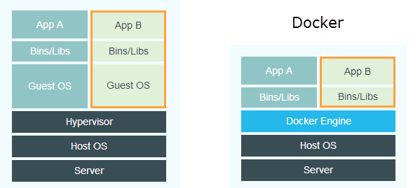

# Perkenalan Docker
Ini adalah kali pertama saya menulis tulisan ber-seri. Tulisan ini Insha Allah akan terus berlanjut sebagai bahan belajar bersama. Penulis pun sedang belajar, bila ada salah dalam materi mohon dikoreksi. Pada kali ini saya akan membahas tentang Docker. Yang dimana seri kali ini hanya akan memperkenalkan tentang seluk-beluk Docker.

## Apa itu Docker?

Docker adalah sebuah alat yang didesain untuk memudahkan dalam `create`, `deploy`, dan `run` aplikasi dengan menggunakan `containers`. `Containers` memungkinkan seorang `developer` untuk melakukan pemaketan aplikasi dengan semua bagian yang dibutuhkan. Seperti `libraries` ataupun `dependencies` yang dibutuhkan. Apapun yang anda lakukan pada `containers` yang sedang berjalan di lokal akan sama dengan yang ada pada `production enviroment` ketika anda melakukan perintah ataupun operasi.  Pada dasarnya, Docker mirip seperti `virtual machine`. Tapi, pada kenyataan nya tidak. Akan saya bahas pada poin berikutnya.

## Perbedaan Docker dan Virtual Machine

Setelah kita mengetahui tentang Docker, mari kita bandingkan antara Docker dan Virtual Machine. Berikut adalah gambar perbandingan:

Ilustrasi gambar tersebut menerangkan tentang keuntungan bila kita memakai Docker. Kita tidak perlu harus menyiapkan sistem operasi lengkap disaat kita membutuhkannya. Yang dimana ini akan memperkecil `resource` yang dibutuhkan. Karena, Docker hanya membutuhkan `kernel` Linux saja pada `Host OS` yang sedang berjalan. Anda bisa mempunyai hampir semua sistem operasi Linux yang bisa dijalankan pada `Host OS`. Pada gambar tersebut juga menerangkan bahwa bila misal anda ingin menjalankan aplikasi pada sistem operasi CentOS( sebelah kiri) dan Debian ( sebelah kanan ), anda tidak perlu melakukan instalasi sistem operasi CentOS dan Debian. Cukup dengan Docker bisa teratasi.

## Docker untuk siapa?

Seperti yang sudah dijelaskan diatas, bahwa Docker didesain untuk memberikan kemudahan serta keuntungan bagi `developer` maupun `system administration`, mungkin banyak orang menyebutnya sebagai `DevOps (developers + operations)` yaitu gabungan antara `developer` dan `system administration`. Bagi para `developer` tak perlu khawatir memikirkan tentang sistem yang akan diberjalan, cukup fokus pada pengembangan aplikasi yang akan dibuat saja. `Developer` juga dapat menggunakan berbagai macam program yang sudah didesain untuk memenuhi kriteria yang dibutuhkan. Bagi para `system administration` sangat menguntunkan dikarenakan `resource` yang dipakai cukup kecil dengan sistem yang dibutuhkan oleh `developer`.

## Kapan sebaiknya menggunakan Docker?

* Gunakan Docker sebagai `version control system` untuk aplikasi
* Gunakan Docker ketika anda ingin mendistribusikan/mengkolaborasikan aplikasi dengan tim
* Gunakan Docker untuk menjalankan `code` pada lokal dengan `enviroment` yang sama seperti pada `server`
* Gunakan Docker ketika aplikasi yang anda buat membutuhkan beberapa fase dalam pengembangan (dev/test/qa/prod)

Referensi:
* https://opensource.com/resources/what-docker
* https://www.ctl.io/developers/blog/post/what-is-docker-and-when-to-use-it/
* https://www.docker.com/use-cases
* http://blogs.gartner.com/richard-watson/ok-get-dockers-great/

